# Web Application Guide

## Authentication Flows

### Welcome Page
.png)
The welcome page welcomes users with Netflix-style interface. From here, you can:
- Access the login page via the "Sign In" button in the top right
- Browse through the featured content preview

### Sign Up

To create a new account:
1. Click the "Sign Up" button
2. Fill in your email address
3. Create a secure password
4. Confirm your password
5. Click "Sign Up" to create your account
Note: All fields are required for successful registration

### Login

To access your account:
1. Enter your registered email
2. Input your password
3. Click "Sign In"
4. If successful, you'll be redirected to the movies page

## Main Features

### HomePage For Signed Users Page

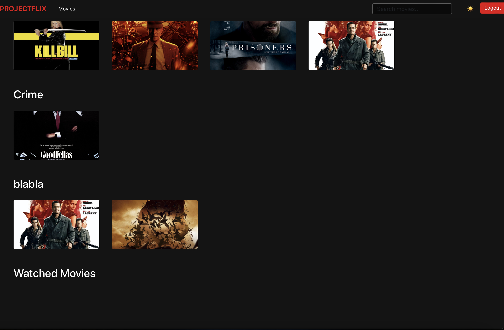
The main content page features:
- A featured movie section at the top with auto-playing trailer
- Categories which are promoted in horizontal rows
- Hover effects on movie cards to show additional information
- Search functionality in the header
- Shows entries from the user movies watched

### Movies Browse Page

The main content page features:
- A featured movie section at the top with auto-playing trailer
- Categories organized in horizontal rows
- Hover effects on movie cards to show additional information
- Search functionality in the header

### Movie Card Component
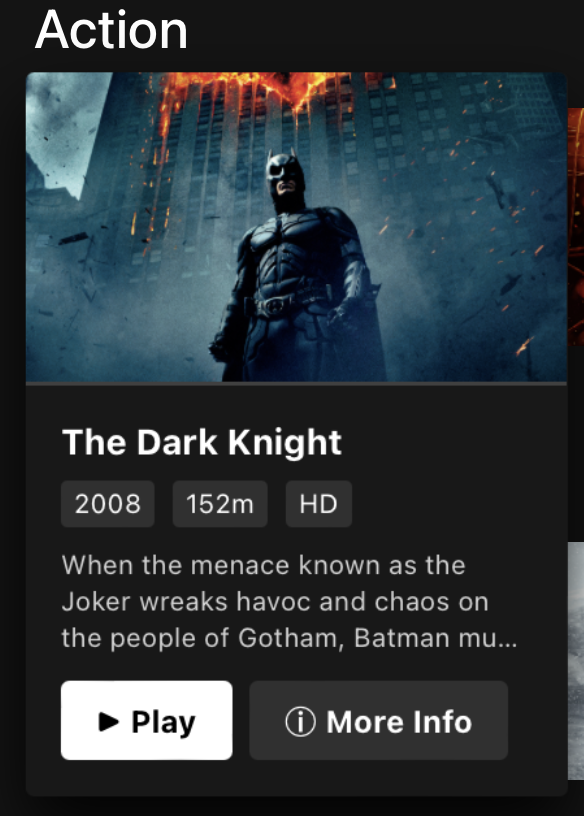

#### Visual Elements
- HD quality badge when applicable
- Title and year overlay
- Duration display
- Hover expansion effect

#### User Interactions
- Hover reveals detailed information
- One-click play button
- "More Info" option for full details
- Automatic history tracking on the go

#### Smart Features
- Dynamic content loading
- Recommendation integration from the c++ server
- Error handling for missing content
- Responsive scaling

### Movie Details
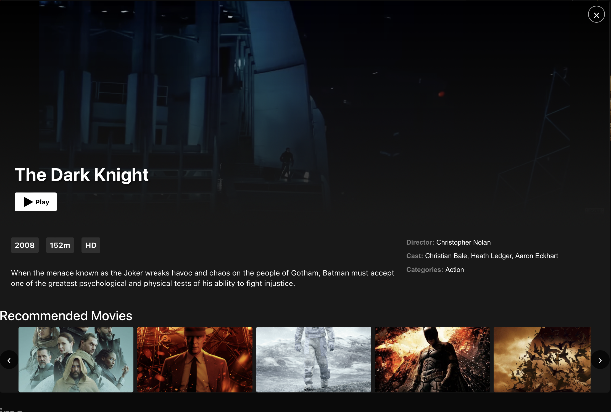
Click on any movie to see:
- Full movie description
- Cast information
- Director details
- Movie duration and release year
- Related categories
- Trailer (if available)
- Similar movie recommendations

### Search Functionality
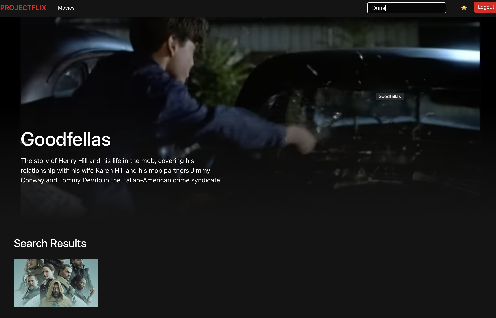
To find specific content:
1. Click the search icon in the header
2. Type your search query
3. Results appear in real-time
4. Results are grouped by relevance

## Admin Features

### Content Management
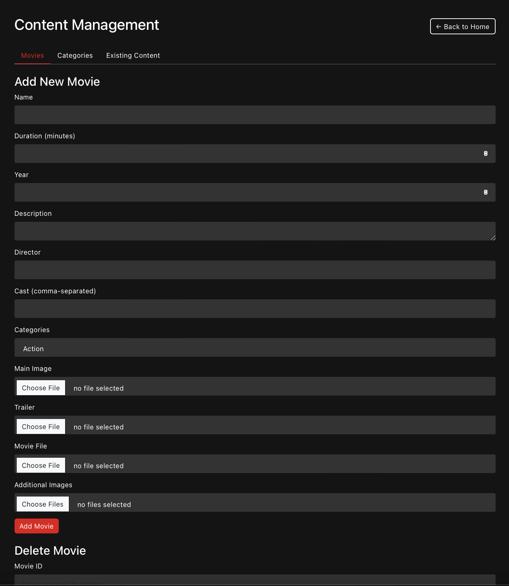
Administrators can access the management page to:
- View all content in a tabulated format
- Add new movies and categories
- Edit existing content
- Delete content
- Manage movie-category relationships

### Add New Movie

The Add Movie section provides administrators with a comprehensive form to create new movies:
- Required fields: Name, Duration (in minutes), and Release Year
- Optional fields: Description, Director, and Cast (comma-separated)
- Category selection through a multi-select dropdown
- File upload capabilities:
  - Main Image: Primary movie poster/thumbnail
  - Trailer: Video file for movie preview
  - Movie File: Full movie content
  - Additional Images: Multiple supplementary images
- Validation ensures all required fields are properly filled

### Delete Movie
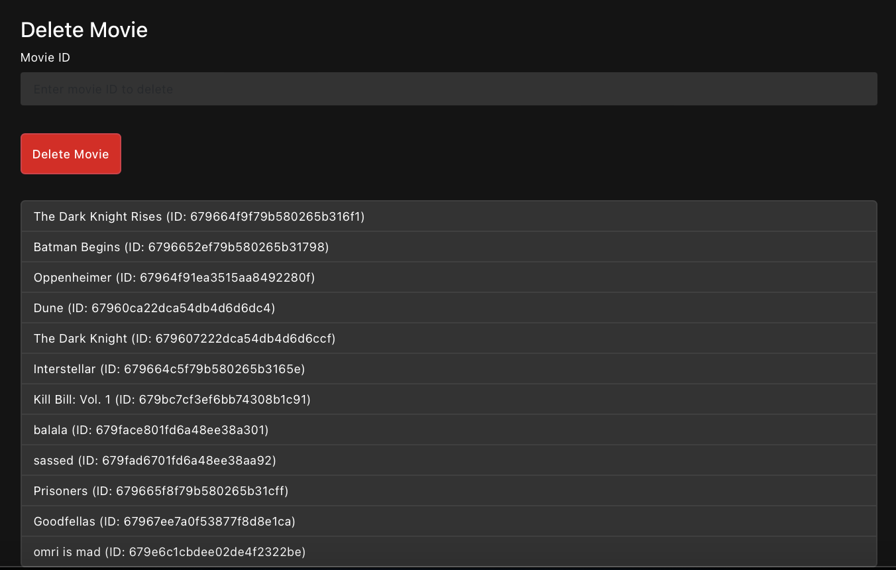
The Delete Movie section offers a straightforward way to remove content:
- Input field for movie ID
- Confirmation before deletion
- Automatic removal from all associated categories
- Real-time update after delete

### Movie List Display

A comprehensive list showing all existing movies:
- Displays movie name and ID
- Organized in a clean, readable format
- Updates automatically after any changes
- Provides quick reference for administrators
- Shows which movies are currently in the system

### Category Assignment
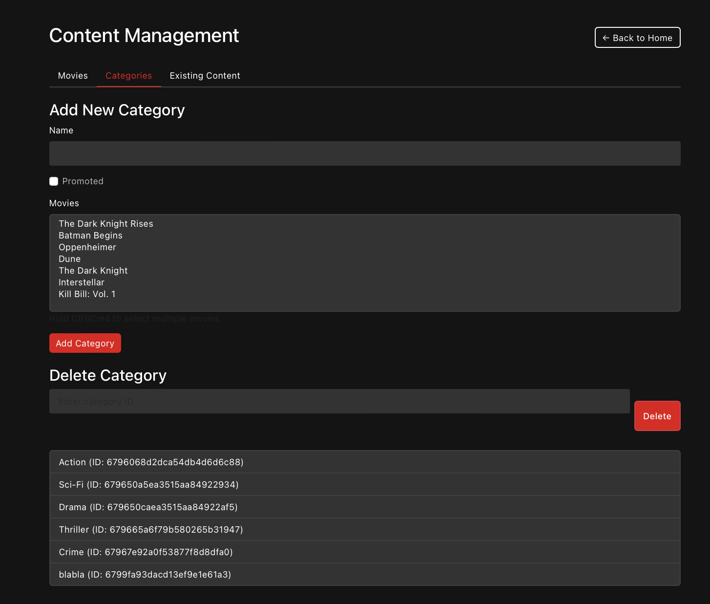
The category management interface allows:
- Multiple category selection for each movie
- Dynamic category list update
- Association/dissociation with categories
- Visibility of current category assignments
- Easy modification of movie-category relationships

### Existing Content Management
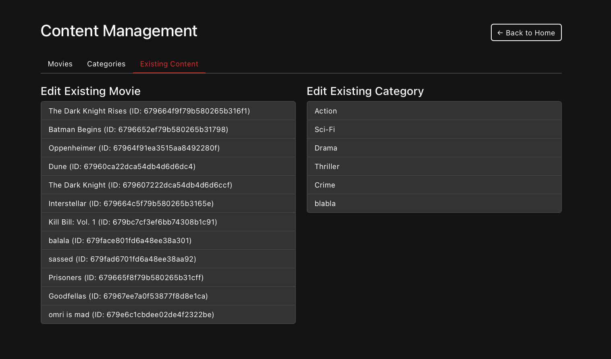
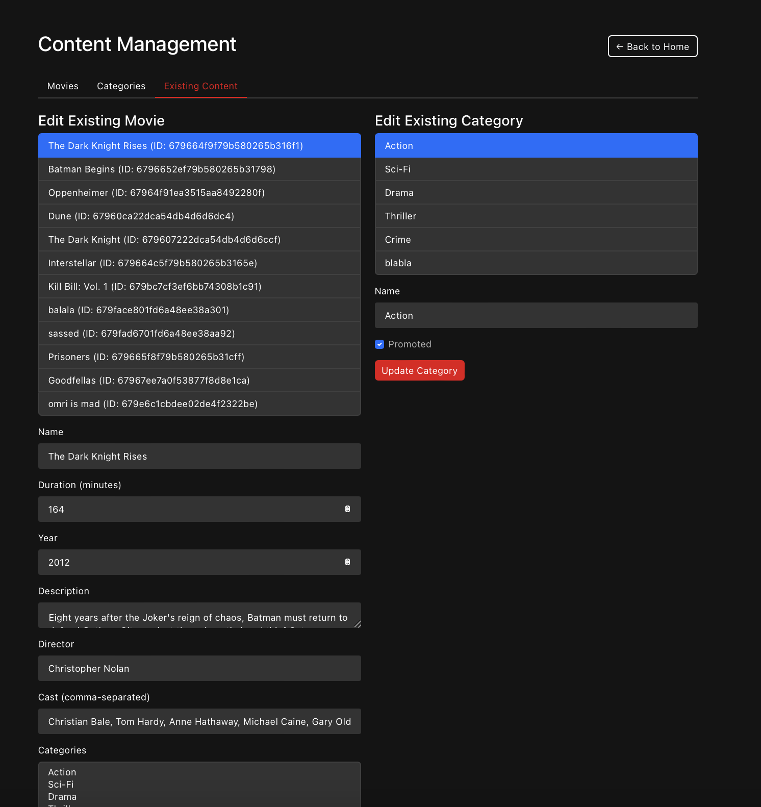
The existing content management interface provides:

#### Movie Editing
- Complete movie information editing
- Select movies from a comprehensive list
- Update all movie attributes:
  - Basic info (name, duration, year)
  - Media files (images, trailers, movie files)
  - Categories and metadata
  - Cast and director information

#### Category Editing
- Modify existing category properties
- Toggle category promotion status
- Update category names
- Manage category-movie associations

#### Features
- Instant feedback on changes
- Error handling and display
- Maintains data

### Theme Toggle - Light/Dark Mode
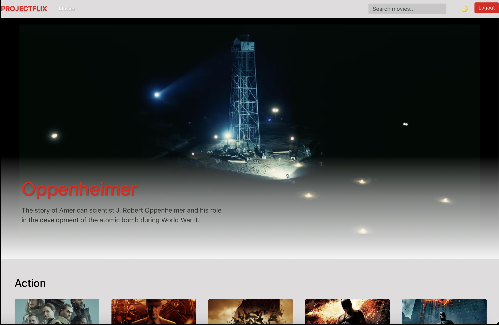
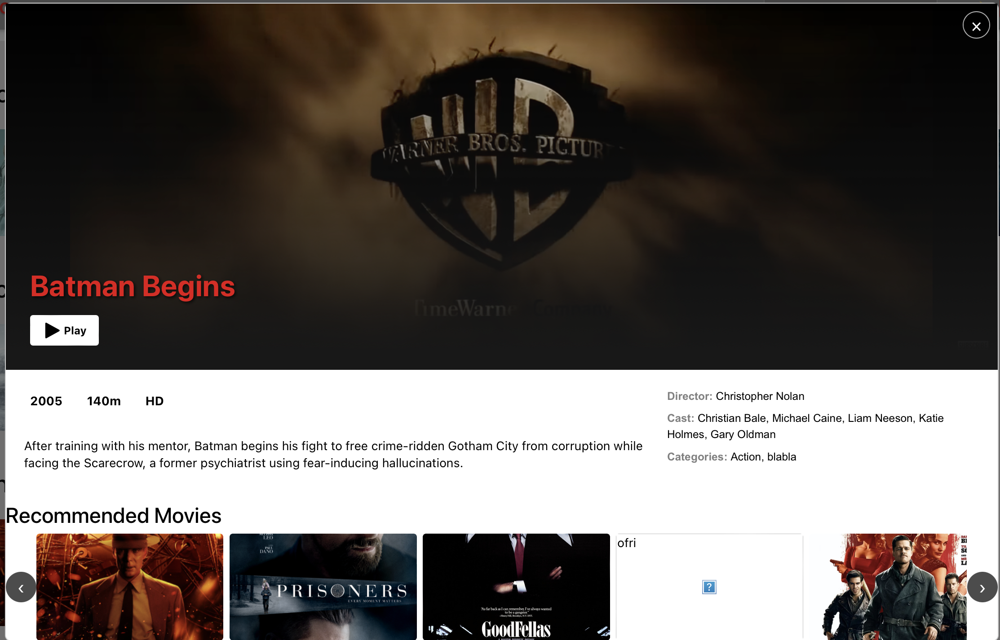

The application provides a comprehensive theming system:

#### Light Mode Features
- Clean white background with dark text
- Adjusted color palette
- Persistent theme preference

#### Key Components Affected
- Navigation bar adapts to light theme
- Movie cards maintain visibility
- Forms and inputs with light styling
- Modal backgrounds adjusting automatically 

